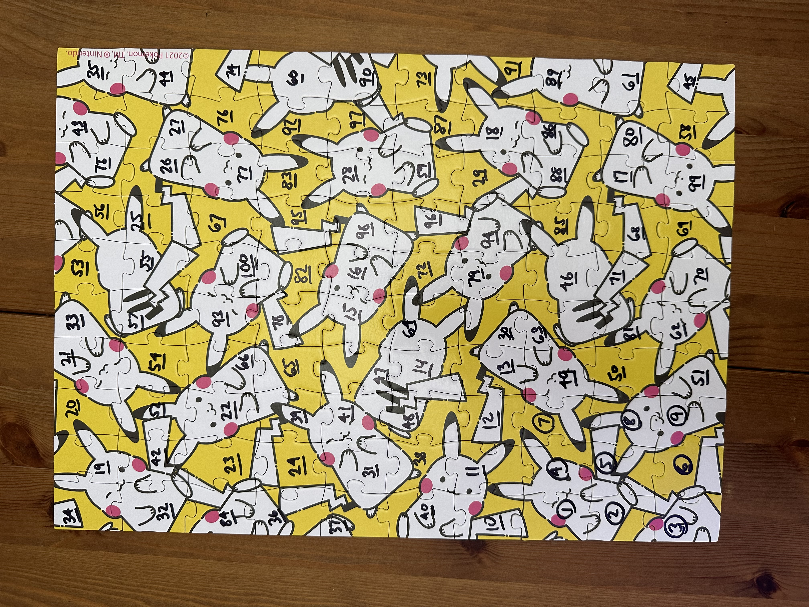
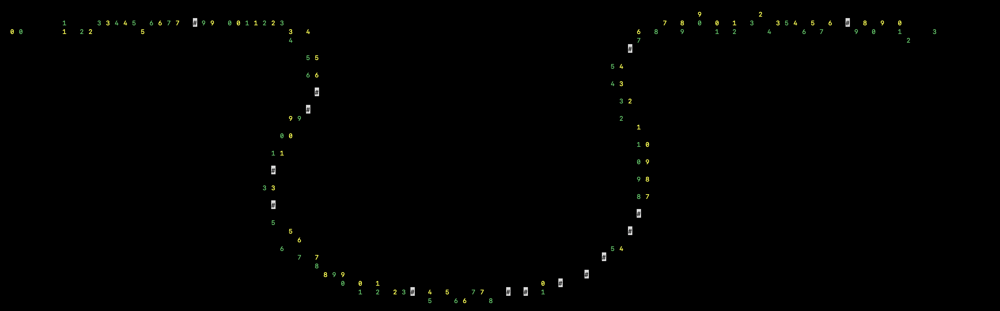

# jigsaw-bot
A python jigsaw puzzle solver

The solution of a 100 piece puzzle, showing each piece's position and orientation:
```
    3^    2^    1^   10<   40>   37>   36v   84<   32<   34v

    6^    5>    4^   11^   38>   31^   24^   23^   42<   19<

    9^    8^    7^   12<   48v   41^   39<   22^   52^   20<

   51<   50^   49<   13<   14<   47^   65^   66^   54<   21<

   62<   81>   63<   30^   64^   15<   78^   93^   57^   33<

   70^   71<   46>   79<   72^   16<   82^  100>   55v   53v

   69<   68<   85v   94^   96^   98^   95v   67<   25<   56>

   99^   17<   88<   29<   59>   28<   83^   77>   26^   75^

   58^   80v   86>   18<   87<   97<   92^   76>   27<   43<

   45^   61v   89^   91<   73<   90<   60^   74<   44^   35v
```

Actual solved puzzle:


ASCII art showing the solver comparing two sides (green and yellow) and their proximity (white=intersection):


## Overview

This solver is designed to run in two modes:

- *Functional solver* where a directory of puzzle piece photos are passed in once, and a solution is computed and spit out
- *Solving service* where imagery can be shared as it is collected, and the puzzle will be progressively solved, then serve up a final solution

## Usage: Functional Solver

1. Drop images into the `./0_input` directory, named starting from `1.jpeg`, onward. There is no significance to the ordering of the numbers.
2. `python3 src/solve.py --path .`
3. To skip processing steps, you can optionally provide the argument `--skip n` to start from step `n+1`
4. To only process one piece, you can provide the argument `--only i`

## Usage: Solving Service

This mode isn't implemented yet, actually.

## Utilities

### Idnetifying a piece

If you have a new photo of an existing piece and need to be able to identify it, you can use the following command:

```
python3 src/find.py --photo-path path/to/new/photo.jpg --puzzle-dir .
```

## Limitations

- The solver will not determine the dimensions of your puzzle. It is hardcoded (e.g. 10x10). This can be changed in `board.py`.
- Photos must be taken on a bright background. Segmentation removes all near-white pixels.
- Currently only sovles puzzles where pieces are four-sides with somewhat normal geometries.
- It isn't perfect and doesn't have great error handling, but the fundamentals are working well.

## TODOs

- The puzzle dimensions are hardcoded. This is obviously cheating.
- Running as a service
- Saving the solution to disk
- Identified piece needs to return orientation too
- Specify a solution file for better debugging logs as it attempts to solve
- requirements.txt
