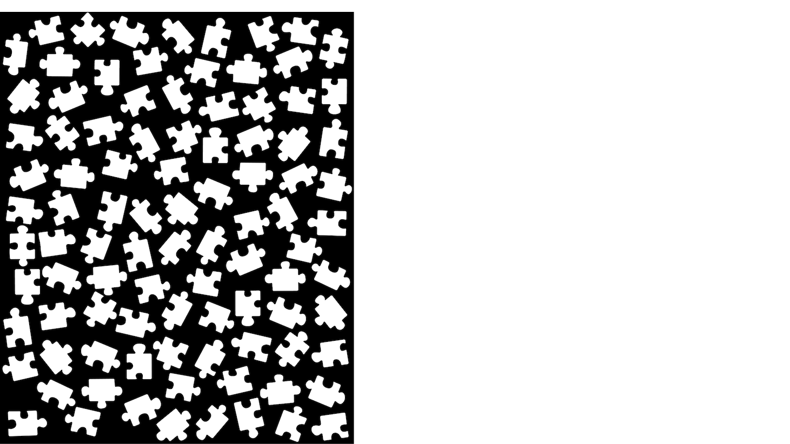

# jigsaw-bot

The code that powers a jigsaw puzzle solving robot. The hope is to be able to solve a 1000 piece all-white puzzle. I'm making some of this easier on myself by assuming each piece is _regular_ shaped (four sides, no whacky geometry).

## Puzzle Solving Overview

1. *Manually lay pieces out in the staging area*
    
    1. Face up
    2. Must have a few mm between pieces
    3. Need not form a grid of any sort

2. Provide configuration about our setup:
    1. **TODO** - this needs to be a YAML file that is passed in. Currently hard-coded
    2. Number of pieces and the dimensions (e.g. 10x10)
    3. Position information about the board
    4. Staging area
    5. Photo Step size
    6. Origin of where the solution should be

3. Robot takes pictures of the staging area along a cornrow path
    
    1. We assemble a mosaic of the staging area as we go
    2. Photos should have approximately one half overlap with the already-built mosaic
    
    3. The solver receives a new photo and the robot’s coordinates
    4. The solver segments the photo to remove the background, downscales it, aligns it with the mosaic, and flattens it down, growing the mosaic outward
    5. The end result is one large binary image that contains all _n_ pieces
    

4. Extract each piece from the mosaic photo

5. Process each piece
    1. Find the edge of the piece in the binary image
    2. Walk along the edge, creating a dense vector path
    3. Clean up the vector path with a few path-simplififying algorithms
    4. Detect the four sides of the piece
    5. Note which sides are edges
    6. Save off the piece's data and metadata about its sides, position in the staging area, etc.

6. Find all other pieces each piece can feasibly connect with
    1. For each side in each piece, compare the geometric fit to all other pieces' sides
    
        1. _ASCII art showing the solver comparing two sides (green and yellow) and their proximity (white=intersection):_
    2. Save off a list of the most likely fits for each side, sorted by their geometric similarity
        1. Note: small improvements to this part of the algorithm have an outsized impace on solve times. This is because the current solver's runtime complexity blows up quickly as the connectivity of the graph (i.e. how many sides could match) gets denser

7. Solve the puzzle
    1. Grab one of the four corner pieces (i.e. a piece whose two adjacent sides are edges)
    2. Walk around the edge of the puzzle, exploring each feasible piece that could be connected
    3. **TODO** add a graphic showing the spiral solving pattern
    4. **TODO** add a graphic showing the corner being evaluated with a piece that fits snuggly but isn't an edge, vs one that is
    5. We keep track of not just which position each piece goes in, but its orientation
    6. We do an exhaustive depth-first search until we've placed all 100 pieces

8. Determine how to move each piece from the staging area to the solution area
    1. Compute where the piece should be gripped from, dropped off to, and how much it needs to be rotated
    

9. Chain the movements in the order of our liking
    1. e.g. spiral from edge, spiral from center, evens then odds, ...

10. Robot executes these movements (still a WIP!)
    1. Follows this coarse path
    2. Uses some nudging/shaking/wiggling to fit pieces together
    3. TBD: do we get the piece close, then take an alignment photo?

## Results

To start, I solved a kid's puzzle. To help with debugging, I randomly labeled each piece with Sharpie, but the algorithm doesn't use this data at all.


The solution of a 100 piece puzzle, showing each piece's position and orientation:
```
    3^    2^    1^   10<   40>   37>   36v   84<   32<   34v

    6^    5>    4^   11^   38>   31^   24^   23^   42<   19<

    9^    8^    7^   12<   48v   41^   39<   22^   52^   20<

   51<   50^   49<   13<   14<   47^   65^   66^   54<   21<

   62<   81>   63<   30^   64^   15<   78^   93^   57^   33<

   70^   71<   46>   79<   72^   16<   82^  100>   55v   53v

   69<   68<   85v   94^   96^   98^   95v   67<   25<   56>

   99^   17<   88<   29<   59>   28<   83^   77>   26^   75^

   58^   80v   86>   18<   87<   97<   92^   76>   27<   43<

   45^   61v   89^   91<   73<   90<   60^   74<   44^   35v
```

I haven't hooked this up to the giant CNC yet, so I don't have any results for physical assembly.


<!-- # Old below

This solver is designed to run in a few steps in conjunction with a robot:

1. **Collect photos of all the puzzle pieces.** Save images of each piece into the `./0_input` directory, named starting from `1.jpeg`, onward.

2. **Run the solver.** This will process the photos and spit out a solution for how all the pieces fit together. `python3 src/find_solution.py --path .`

3. **Assemble the puzzle.** This part is still unimplemented, but utilities that guide the robot will come soon!

## Utilities

### Idnetifying a piece

If you have a new photo of an existing piece and need to be able to identify it, you can use the following command:

```
python3 src/identify_piece.py --photo-path path/to/new/photo.jpg --puzzle-dir .
```

## Limitations

- The solver will not determine the dimensions of your puzzle. It is currently hardcoded (e.g. 10x10). This can be changed in `board.py`.
- Photos must be taken on a bright background. Segmentation removes all near-white pixels.
- Currently only sovles puzzles where pieces are four-sides with somewhat normal geometries.
- It isn't perfect and doesn't have great error handling, but the fundamentals are working well.

## TODOs

- The puzzle dimensions are hardcoded. This is obviously cheating.
- Running as a service
- Saving the solution to disk
- Identified piece needs to return orientation too
- Specify a solution file for better debugging logs as it attempts to solve
- requirements.txt -->
